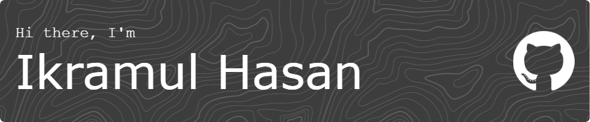

An aspiring engineer 🚀 with an immense thirst for learning new technologies 👌 I value teamwork and an inviting environment for expressing new
ideas. I’m always intrigued by the new frameworks and technologies that the software industry brings forward.

<!--  -->
  
### 🧐 More About Me:

- 🔭 &nbsp; Working at [Monsha AI](https://monsha.ai), and building [inboxswipe](https://inboxswipe.com), and [GG](https://ikram.click/gg)
- 🔍 &nbsp; Find all my socials, contacts, blogs, and more on my personal portfolio site - [ikramhasan.com](https://www.ikramhasan.com/)
- 🌱 &nbsp; I’m currently learning Rust
- 👨🏻‍💻 &nbsp; Most of my projects are available on [Github](https://github.com/ikramhasan?tab=repositories)
- 💬 &nbsp; [Ask me](mailto:contact@ikramhasan.com) about anything tech related, I am happy to help
- 📫 &nbsp; Feel free to ping me on [LinkedIn](https://www.linkedin.com/in/ikramhasan/)
- 📚 &nbsp; I am currenly reading [The Things You Can See Only When You Slow Down](https://www.goodreads.com/book/show/30780006-the-things-you-can-see-only-when-you-slow-down)

## Blog posts

I've started writing blogs. Since I'm very new at this, I would love to hear your suggestions and critisism. Thanks. 

<!-- BLOG-POST-LIST:START -->
- [GG: The Journey of Building and Marketing an App](https://blog.ikramhasan.com/gg-the-journey-of-building-and-marketing-an-app)
- [Automagically translate your entire app with just one command using AI ✨](https://blog.ikramhasan.com/automagically-translate-your-entire-app-with-just-one-command-using-ai)
- [How I Made a TicTacToe Game That You Cannot Beat 🙅‍♂️](https://blog.ikramhasan.com/how-i-made-a-tictactoe-game-that-you-cannot-beat)
- [BEST VSCode Settings for Flutter Developers 🚀](https://blog.ikramhasan.com/best-vscode-settings-for-flutter-developers)
<!-- BLOG-POST-LIST:END -->

## Stats

  

## 🔧 Technologies & Tools

## 🗂️ Highlighted Projects

## Trophies

<!--
**ikramhasan/ikramhasan** is a ✨ _special_ ✨ repository because its `README.md` (this file) appears on your GitHub profile.

Here are some ideas to get you started:

- 🔭 I’m currently working on ...
- 🌱 I’m currently learning ...
- 👯 I’m looking to collaborate on ...
- 🤔 I’m looking for help with ...
- 💬 Ask me about ...
- 📫 How to reach me: ...
- 😄 Pronouns: ...
- ⚡ Fun fact: ...

import Vue from "vue";
import App from "./App.vue";
import TypeIt from "typeit";

Vue.config.productionTip = false;

new Vue({
  render: h => h(App)
}).$mount("#app");

new TypeIt("#inner-demo-2", {
  speed: 100,
  lifelike: true,
  cursor: true,
  cursorSpeed: 300,
  loop: true
})
  .pause(1000)
  .type('👋', {
    html: true
  })
  .type("&nbspHi&nbspthere!&nbspI'm&nbspIkramul&nbspHasan.")
  .pause(750)
  .move(-6)
  .delete(3, { deleteSpeed: 130 })
  .pause(500)
  //.type("&nbspcom")
  //.pause(500)
  .move(-5)
  .type("https://")
  .move(11)
  .type("com")
  .move("END")
  .pause(1000)
  .go();

-->
